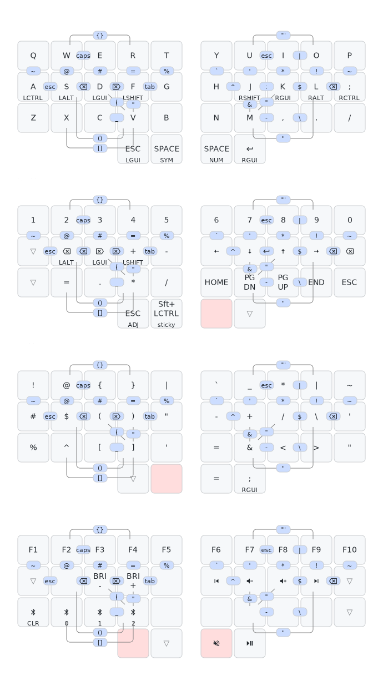

## ZMK Configs

#### [34 key 3x5+2 keymap layout:](https://caksoylar.github.io/keymap-drawer?keymap_yaml=H4sIAAAAAAAC_5VW_1LbRhD-30-xwSQH4UQsgQGrbSbGYOLUEIqhbUocR7ZlrLEsaaRTKCXOY_Rt-jJ9ku6dTtJJ2OOUGa3kb2_39se3d1Rd68GPmQmPf81ng5n9MPStcGzCKLTGjr-oVOPI8e4gurftYCsBtykMYwZ-yKY-2Fbk2CEwH0LbGleqlSp0PBj53sS5Az9gju9FENkMofnQH9ybYNThhfw1NUGvQyULQbgcZD-jwHXwzcLYphD695EJexRN3Xju4XedApvG8yF-GosF92KHkVkBOG72Tvlbg1v4hcJvFE4pXFG4pvCBwg2FDoX3FC6hLxc94i5NChhOt3V91V1QgfQSpNm9lsBJApzddCTQToDe2077epF5O6PwNtG_E_qrRJ9APydQ7qObAPkuPySACCTz-QeF3ym0KPxK4ZjCBYVzCoQSCrsUXhUSOe21ynH2LputUwH2Ppw_wS5uUmxzcz52zJQEWmizOPQ2N_OQxUa4Pq0u0TECYnCxx8U-F3UuDrg45OKIiwYXNaLG-e_f_2ADHwKbd9jyokIMQ2s0iwJrZGtIBdfxbBmF0o3ywtD-gv1_YpBXYUftFoajYUyJEytEdmmuPWEamzoiY1Ux9u-9pYo4WAqHzt207GlJQrCmGuSnpL3kJb5fIanen2PDLs_g5EK8bi6R2BdIStFxtfXNk3eLgvfehO0Iagt1xJzR7EFURWw4td2xrNGTMIQbZE3W8We8k2-4eORiwcVXLj6jGMhoE-QbF1WSRYLF2KKAxwfZILL-OyKzj_gL_7KFQJ6j7hOit3xhnyR6WRLyAsWP-H5NhCuAtbRS0xQ-lEHLeI1VS7Ns6xTaBj543rT38cGzpn2AzyE-R_g08NFrazvIAzy-6oCWfuyQBE1IEc2cQAuQuI4fRzlXvvATztbmjrcEDVwVFB48-0_GodUNTGOUXHRjm_k-m8oZIa3uFSlOVXlFbY1eX6M3SFqO0rMu5rUEVbeVJfInE75vwTZZEOAloQVWHCXjJ24hvDI0eITAhFsdW6wf9inMMGQTo3MR5LdJHxZLF608MLkhnpNlO-NAOucUtkwY-oz5cwoYMd6RJmi7jbpqgrTTpcknBT_IYTE3eE1nJjXU7SU6XpgIJ98dsdBVJ79gwJ01igbhEoNsPY6EITcQc7wiDcUCDeT6kRVERHHGg61J3TdVgTa6LhVvVAUOpZ56q6qKvTxvnHBFgeOr70vFc1XBi1uXis-kWF7ZXzsaKTgO_5Fc_5UU8Yw1L1UFnhR6avFMVTTympfyruWJFzfX9Tzz1VeKst7IC7L2qizZGQqBtgQPtnGExsm_YlAiQ1pcZg1VzWGe-2YJz6aA02eZ16O8PN-TqqGEPFBxPnFpY7QCi3gUMrqPJYs06g1CNpaye1dHSoEVjgbRyHLxiNltFMmTtnxDjgfzg5L1KmPsccrhx8X_NtaVydzaJt8Z_KFaekP1cdtf4WMfD6n_ADqIO8s5DAAA)

(^links to keymap-drawer keymap)

Keymap diagram created with:
https://keymap-drawer.streamlit.app/
(https://github.com/caksoylar/keymap-drawer)

